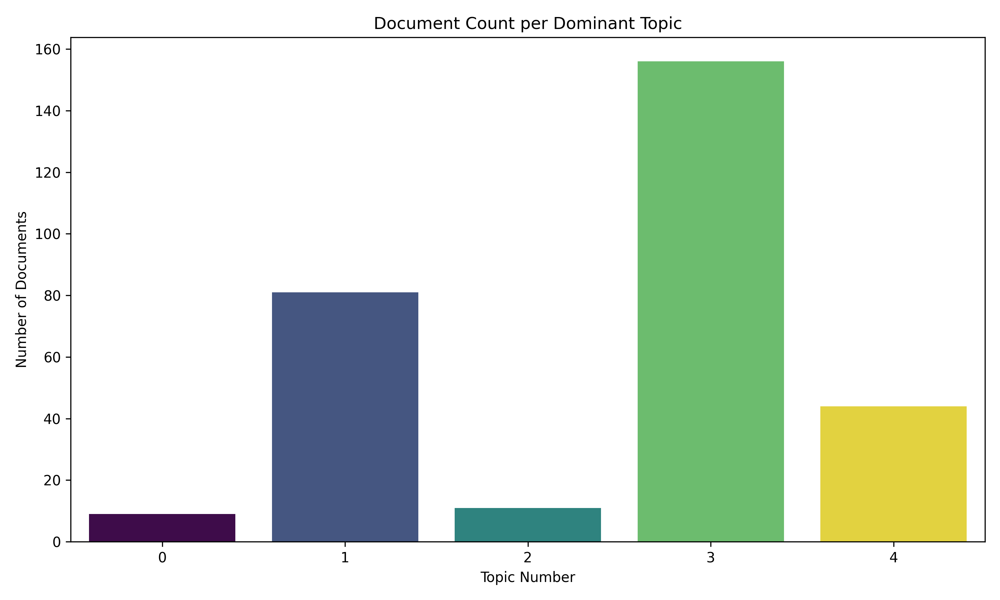

# News2Topics - LDA-based Topic Modeling

**News2Topics** is a topic modeling project that uncovers hidden themes from a collection of news articles using **Latent Dirichlet Allocation (LDA)**. The project processes raw text data, extracts key topics, and uses an **LLM** to assign human-readable names to each discovered topic.

---

## 📂 Dataset

- **input.csv**: This single CSV file contains all the news articles used in the project.
    - Columns: `URL`, `Date`, `Headline`, `Content`, `Portal`, etc.

---

## 🔍 Pipeline Overview

1. **Preprocessing**
   - Tokenization, stopword removal, punctuation stripping
2. **Corpus Creation**
   - Build dictionary and bag-of-words using `gensim`
3. **Topic Modeling**
   - LDA is applied to extract dominant topics from text
4. **Topic Labeling**
   - A **Large Language Model (LLM)** is used to generate meaningful names for each topic
5. **Output**
   - Final topics with top words and labels stored for analysis or visualization

---




---

## 📊 Sample Topics Output

```python
topics = { 
    1: 'said, road, news, accidents, people, bus, police, vehicles, star, daily',
    2: 'road, said, news, police, daily, accident, star, around, accidents, also',
    3: 'police, injured, said, bus, upazila, news, killed, around, hospital, people',
    4: 'said, police, star, news, daily, accident, road, dhaka, bus, injured',
    5: 'said, police, news, road, daily, mymensingh, bridge, truck, star, bangladesh',
}

---


